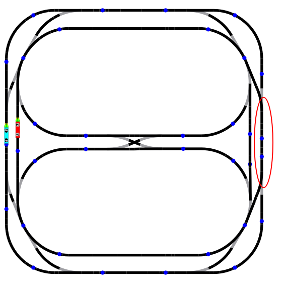

# Laboratoire 5 - Gestion de ressources

Auteurs: Jérôme Arn, Tiffany Bonzon

## Description des fonctionnalités du logiciel

Le but du labo est de réaliser la gestion et le contrôle de deux locomotives en utilisant des sémaphores. Les deux locomotives doivent faire deux fois le tour de leur tracé avant de changer de direction, et refaire deux tours pour effectuer à nouveau un changement de direction, ceci de manière infinie. Les deux tracés partagent une section. Le premier programme ne gère pas les priorités, contrairement au deuxième programme. Dans le deuxième programme seul une des deux locomotive se voit assigné la priorité "High" ce qui lui permet d'avoir un accès prioritaire à la section partagée.

## Choix d'implémentation

### Trajets

Les deux locomotives tournent en rond, chacune sur leur cercle initial (une à l'intérieur, l'autre à l'extérieur). La section partagée est entourée en rouge sur l'image ci-dessous. Les deux locomotives ont la vitesse définie par le code qui nous a été fourni. Pour les priorités de la partie 2, la locomotive Bleue (sur l'image) s'est vue attribuée la "High" priorité.

### Aiguillages

La gestion des aiguillages est réalisée par la classe `SharedSection`. Au moment où une des deux locomotive s'est vue autorisé l'accès à la section partagée. Ceci afin de garantir qu'une fois que la locomotive est engagée sur la section partagée, celle-ci ne peut pas être changée.

### Booléen de direction

l'Attribut à été ajouté à la classe `LocomotiveBehavior` afin d'avoir un indicateur de la direction dans laquelle roule la locomotive. Ceci est utilisé pour définir quels points de contacts sont utilisés par chaque locomotive pour la gestion de la section partagée. Ce booléen est inversé à chaque fois que la locomotive change de direction.

### Classe `LocoSSPoint`

Cette classe à été ajoutée afin de faciliter le stockage des points importants à l'accès de la section partagée de chaque locomotive. Cette classe stocke les points de contacts auxquels chaque locomotive doit faire la demande d'accès, l'accès, ainsi que la sortie de la section partagée. Cette classe contient les points de contacts pour quand la locomotive va dans le sens initial, ainsi que le sens inversé.

### Point de départ

Le point de départ de chaque locomotive est passé à la classe `LocomotiveBehavior` afin d'aider à compter le nombre de tours avant le changement de direction

### `SharedSection` - booléen indiquant si la locomotive prioritaire est en attente

Vu qu'il n'y a que deux locomotives, et qu'une de ces locomotive est prioritaire, il n'est pas util d'avoir un compteur. Cet indicateur modifié lors de la demande d'accès et lors de la sortie est suffisant à réaliser les objectifs du labo.

## Tests effectués

- Le changement de direction d'une des locomotive n'a pas d'effet sur la direction de l'autre locomotive
  - Une locomotive mise en pause reprend son exécution normale même si l'autre à changé de direction entre temps
- Si une locomotive est engagée sur la section partagée, l'autre ne peut pas y accéder
  - En lançant le programme de base, les deux locomotives arrivent quasi en même temps à leur point de demande d'accès à la section partagée
    - Dans le premier programme on voit que la locomotive Bleue s'arrête jusqu'à que la locomotive rouge ait passé son point de sortie de section partagée
    - Dans le deuxième programme, on voit que la locomotive prioritaire (Bleue) prend la priorité sur la rouge (qui affiche un message indiquant qu'elle laisse sa place à la locomotive prioritaire)
- La direction des locomotives n'a pas d'effet sur la priorité d'accès à la section partagée
- Si la locomotive de priorité basse est engagée sur la section partagée, la locomotive prioritaire s'arrête et attend que la section partagée soit libre.