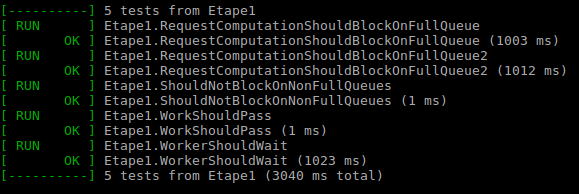
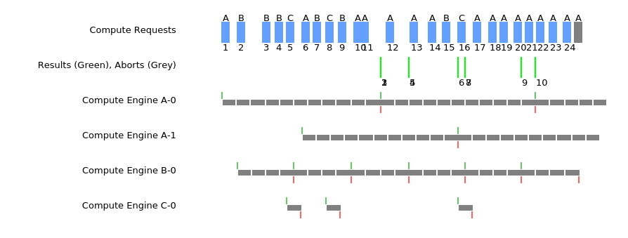
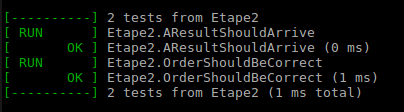
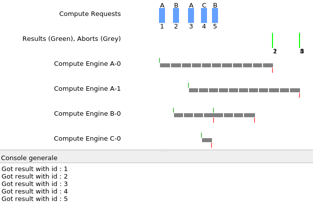
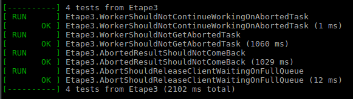
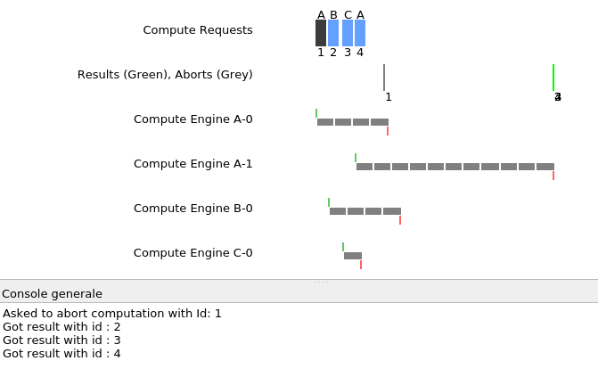
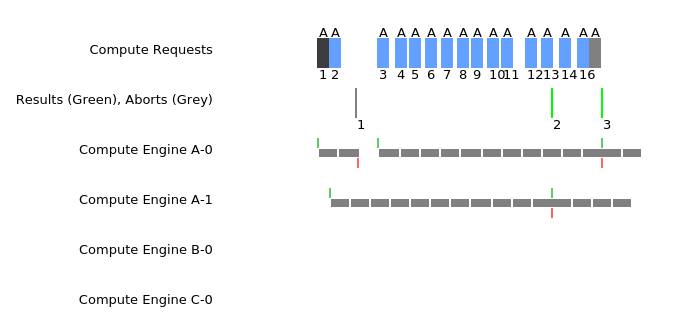
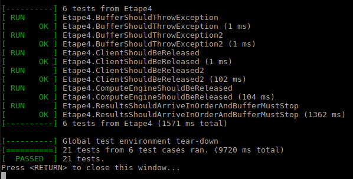
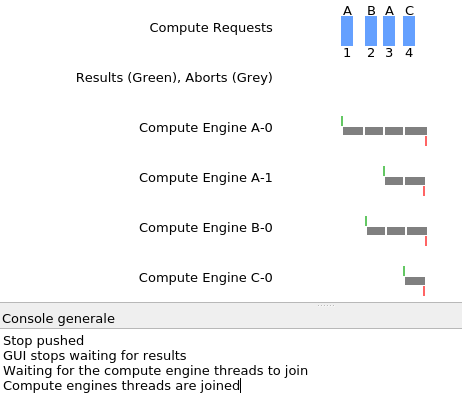

# Laboratoire 06 PCO

> - Jérôme Arn 
>- Tiffany Bonzon

## Étape 1

Afin de réaliser cette étape, nous avons décider de séparer les fles d'attentes par le type de calcul demandé (A, B, ou C). 

Chacune de ces files acceptent jusqu'au nombre de calculs passé au constructeur, par exemple avec `ComputationManager(8)`, chaque file pourra avoir 8 calculs avant que les calculs suivants soient mis en attente. Une fois qu'un calcul est ajouté à une des files, on envoie un signal particulier à la file pour indiquer aux threads attendant qu'elle ne soit plus vide qu'elle ne l'est plus (je...sais pas comment j'ai eu 5.6 en COMM). Chaque calcul est accompagné d'un `id` lorsqu'il est ajouté dans une des files d'attente. Le premier `id` est 1 et estpartagé entre les files (si on ajoute un calcul dans la file A puis dans la file B, les ids seront respectivement 1 et 2)

Les threads voulant récupérer un calcul attendent que leur file ne soit plus vide. Une fois un calcul récupérer par le thread, le calcul sera supprimé de la file d'attente.

### Test

Nous avons commencé par vérifier que les tests automatisés passaient 

Puis nous avons tester avec la GUI fournie que les calcule étaient bien placés dans la file demandée, et également que la taille des files n'était pas dépassée

- Nous voyons ici que les calculs sont ajoutés à la file séléctionnée

- Nous voyons également que le dernier calcul de la file A est en attente, car la file est pleine

## Étape 2 

Pour cette étape, le client va attendre que le résultat (dans l'ordre des demandes) soit disponible. L'ordre est déterminé par les `id` des résultats (qui est égal à l'`id` du calcul demandé). Afin de donner les résultats dans l'ordre, nous avons implémenter un compteur global initialisé à 1 qui s'incrémente à chaque fois qu'un résultat est obtenu par le client. La comparaison entre ce compteur et l'`id` du résultat nous permet de mettre les threads en attente quand cela est nécessaire. Une fois le résultat obtenu par le client, il est effacé de la map contenant tous les résultats des calculs.

Les threads fournissant les résultats les mettent simplement dans une map avec comme clé l'id du calcul, et comme valeur le résultat du calcul. Ã chaque résultat entré dans la map, un signal est envoyé aux threads attendant que la map ne soit pas vide. Concernant l'attente des résultat ordrée, nous réveillons tous les threads en attente sur cette condition.

### Test

Nous avons commencé par vérifier que les tests automatisés passaient 

Puis nous avons tester avec la GUI fournie que le client pouvait obtenir tous les résultats dans l'ordre des calculs demandé.

- Nous voyons ici que tous les résultats sont affiché par le client
- Nous voyons également que bien que le résultat 2 est disponible avant le résultat 1, celui-ci n'est affiché par le client qu'après. Même chose pour les résultats 3, 4, et 5

## Étape 3 

Lorsqu'un client demande d'annuler un calcul, nous ajoutons l'id du calcul dans un set afin de s'assurer qu'un id n'y apparaît qu'une seule fois. Puis nous cherchons l'id dans une des 3 files de calculs (A, B, ou C) et dans notre map de résultat afin de le supprimer. Si le calcul est supprimé d'une des 3 files, nous envoyons un signal spécifique à la file afin d'indiquer qu'elle n'est plus pleine.

La méthode `continueWork(id)` va simplement vérifier si l'id passé en paramètre se trouve dans le set des calculs annulés.

Avec l'ajout de cette fonctionnalité, nous avons du légèrement modifier nos méthodes précédantes afin de prendre l'annulation d'un calcul en compte

- `getNextResult()` : Afin de ne pas bloquer l'affichage de tous les résultats suivant un calcul annulé, nous incrémentons notre compteur global si l'id attendu est un id d'un calcul annulé
- `provideResult(Result)` : Ici, nous vérifions que le calcul n'a pas été annulé avant de placer le résultat dans notre map de résultats et avant de lancer les signaux.

### Test

Nous avons commencé par vérifier que les tests automatisés passaient 

Puis nous avons tester avec la GUI fournie que la demande d'arrêt d'un calcul soit bien effectuée

- Nous voyons ici que le résultat 1 n'est pas affiché, et que les résultats suivants ne sont pas bloqués et arrivent toujours dans le bon ordre

- Ici, nous voyons que l'annulation d'un résultat libère une place dans la file d'attente de calculs

## Étape 4 

La méthode stop vapasser le booléen `stopped` à true et, avec l'aide d'une nouvelle fonction `stopWaitingQueue(cmp, condition)`, réveiller tous les threads en attente sur une certaine condition. Toutes les conditions utilisées par nos méthodes sont affectées par `stop()`

Afin d'arrêter au plus vite tous les threads, nous avons du modifier les méthodes

- `requestComputation` et `getWork` : Chaque boucle d'attente va vérifier le bool `stopped`. Une fois le `wait()` passé, si `stopped` est à true, alors nous sortons du switch, et une fois sortit du moniteur, nous lancons le `throwStopException`
- `getNextResult` : Là aussi, nos boucles d'attentes vérifient la booléen. L'affichage du résultat, la suppression dans la map, et l'incrémentation du compteur global ne sont effectués que si `stopped` est à false, et une fois sortit du moniteur, nous lancons le `throwStopException`
- `continueWork` : Vérifie maintenant également le booléen `stopped` avant de retourner si le travail doit continuer ou non.

### Test

Nous avons commencé par vérifier que les tests automatisés passaient 

Puis nous avons tester avec la GUI fournie que le bouton Stop arrête bien tous les threads
